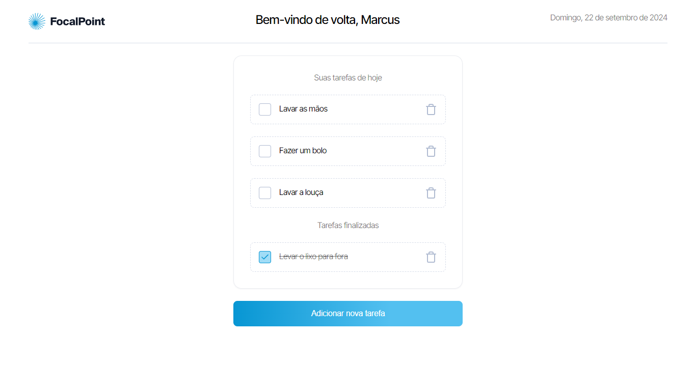

## LEGAPLAN FRONTEND CHALLENGE

### 🤔 Sobre
O teste consiste no desenvolvimento de uma aplicação front-end, no formato TODO APP, utilizando NEXTJS. O projeto contém as seguintes funcionalidade:

[x] - Criar tarefa
[x] - Remover tarefa
[x] - Finalizar tarefa

DEPLOY: [challenge-legaplan]

### 🛠 Tecnologias/Ferramentas utilizadas

[react]
[nextjs]
[typescript]
[sass]
[react-hook-form]
[zod]
[biomejs]

### 🚀 Como executar o projeto

```bash
# Clone o projeto
$ git clone https://github.com/MatheusGCM/challenge-legaplan.git

# Entre na pasta
$ cd challenge-legaplan

# Instale as dependências:
$ npm i

# Execute o app:
$ npm run dev
```
<br/>

### 💻 Preview



[typescript]: https://www.typescriptlang.org/
[biomejs]: https://biomejs.dev/pt-br/
[react]: https://react.dev/
[nextjs]: https://nextjs.org/docs
[sass]: https://sass-lang.com/
[react-hook-form]: https://react-hook-form.com/
[zod]: https://zod.dev/

[challenge-legaplan]: https://challenge-legaplan.vercel.app/
